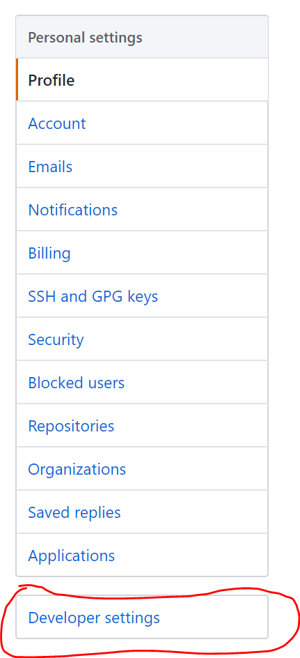
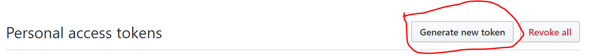

---
output:
  md_document:
    variant: markdown_github
---

<!-- README.md is generated from README.Rmd. Please edit that file -->

```{r, echo = FALSE}
knitr::opts_chunk$set(
  collapse = TRUE,
  comment = "#>",
  fig.path = "README-"
)
```

[](https://cran.r-project.org/package=RepoGenerator)
[](https://travis-ci.org/jaredlander/RepoGenerator)
[](https://ci.appveyor.com/project/jaredlander/RepoGenerator)
[](https://codecov.io/github/jaredlander/RepoGenerator?branch=master)

# RepoGenerator

Generates a project and repo for easy initialization of a workshop.

# GitHub Token

This is dependent on having a GitHub [Personal Access Token](https://blog.github.com/2013-05-16-personal-api-tokens/) (PAT).

First, go to GitHub user settings. Then click on `Developer Settings`.

```{r settings-image,echo=FALSE}

```

On the following page click `Personal Access Token`.

```{r dev-settings-image,echo=FALSE}
knitr::include_graphics('tools/readme/GitHub-Developer-Settings.png')
```

Then click `Generate new token`.

```{r token-generation-image,echo=FALSE}

```

Finally, select the `Repo` option.

```{r repo-option-image,echo=FALSE}
knitr::include_graphics('tools/readme/PAT-Options.png')
```

The way some of the packages this package depends on are written, require that this code be saved in an environment variable. The best way to do this is to have a file named `.Renviron` in your home directory which can be located with `Sys.getenv('HOME')`. The file should look like this.

```{sh,eval=FALSE}
GITHUB_PAT='LongStringOfNumbersAndLetters'
```

# Generating a Project

To create a project and turn it into a GitHub repo use the `createRepo` function.

If you have a list of data files stored somewhere that you want the user to download, build a `data.frame` listing at least the local name to be used for the data, the URL where the data are stored and the mode to write the data such as 'w' or 'wb'. If you don't provide one, the default data stored in my [data.world](https://data.world/landeranalytics/training) repo will be used. You should also specify a set of packages for the users to install.

```{r data-list}
data(datafiles, package='RepoGenerator')
datafiles[, c('Local', 'Remote', 'Mode')]
```

```{r package-list}
packages <- c('caret', 'coefplot','DBI', 'dbplyr', 'doParallel', 'dygraphs', 
              'foreach', 'ggthemes', 'glmnet', 'jsonlite', 'leaflet', 'odbc', 
              'recipes', 'rmarkdown', 'rprojroot', 'RSQLite', 'rvest', 
              'tidyverse', 'threejs', 'usethis', 'UsingR', 'xgboost', 'XML', 
              'xml2')
```

```{r example,eval=FALSE}
createRepo(
    # the name to use for the repo and project
    name='WorkshopExampleRepo', 
    # the location on disc to build the project
    path='~/WorkshopExampleRepo',
    # the list of data files for the user to download
    data=datafiles,
    # vector of packages the user should install
    packages=packages,
    # the GitHub username to create the repo for
    user='jaredlander',
    # the new repo's README has the name of who is organizing the class
    organizer='Lander Analytics',
    # the name of the environment variable storing the GitHub PAT
    token='MyGitHubPATEnvVar'
)
```

# GitHub

The earlier code created [this repo](https://github.com/jaredlander/WorkshopExampleRepo) on GitHub. You can point your attendees to the repo you created for easy instructions on getting ready for the workshop!
